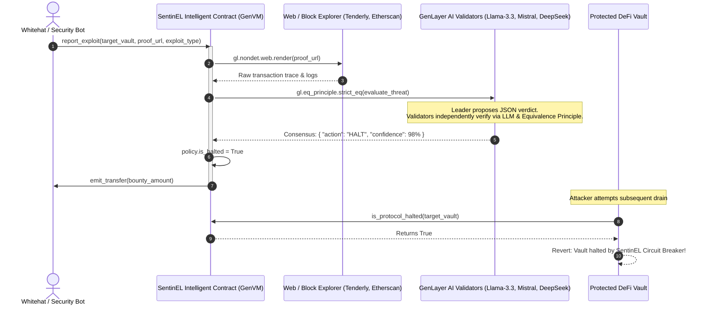

# SentinEL 🛡️
### Autonomous Protocol Circuit Breaker & Whitehat Escrow
> **Submission for GenLayer Hackathon | Agent Tank — Track: Autonomous Protocols**

[](https://docs.genlayer.com)
[](https://portal.genlayer.foundation/agent-tank/hackathon)
[](LICENSE)
[]()

---

## ⚡ Executive Summary

When an exploit strikes a DeFi protocol, millions of dollars are drained in seconds. Traditional multi-sigs and DAO emergency votes take hours or days to assemble quorum. Purely deterministic EVM smart contracts cannot inspect off-chain transaction traces, parse security alerts, or evaluate qualitative security parameters.

**SentinEL** is an **Intelligent Contract** built on GenLayer that creates an **autonomous, self-governing circuit breaker**:
1. Protocols register their contracts with natural-language security policies (e.g. *max slippage 2.5%*, *no recursive reentrancy*, *withdrawal cap 100 ETH*), and fund a whitehat bounty pool.
2. Any automated agent or whitehat researcher can submit an incident report with a live web trace URL (Etherscan, Tenderly, or Blockscout).
3. **Decentralized AI Validators** independently fetch the live trace via `gl.nondet.web.render`, cross-examine it against the protocol's registered policy, and achieve consensus via GenLayer's **Equivalence Principle**.
4. If a critical breach is confirmed, SentinEL **autonomously flips the circuit breaker to HALT**, protecting the remaining pool funds, and **immediately disburses the bounty** to the whitehat's wallet.

---

## 🎯 Track Alignment: Autonomous Protocols

> *"Systems that run themselves. If a contract pauses, tunes or rewrites another contract or its own rules with no one voting, it belongs here."* — GenLayer Agent Tank Hackathon Guidelines

SentinEL directly fulfills this mandate:
* **No Human Voting**: The circuit breaker trips through decentralized validator consensus based on machine-evaluated evidence.
* **Autonomous Invariant Enforcement**: Protects dependent target vaults from catastrophic exploits without human intervention.
* **Ecosystem Reference**: Sets the initial reference implementation for the Autonomous Protocols track.

---

## 🏗️ Architecture



---

## 🌐 Verified StudioNet Deployment

* **Contract Address**: `0xc0547231791DE68E62d7fbcd222766BB86C800C8`
* **Deployment Tx**: `0x636933938db7e1c81a24d5b0b3396e05816bf60b774968e06806a62f4cec45ea`
* **Studio Explorer**: [https://explorer-studio.genlayer.com/address/0xc0547231791DE68E62d7fbcd222766BB86C800C8](https://explorer-studio.genlayer.com/address/0xc0547231791DE68E62d7fbcd222766BB86C800C8)
* **Consensus Status**: `ACCEPTED` (5/5 Validators Consensus: `MAJORITY_AGREE`)
* **Live Web App**: [https://olasmi02.github.io/genlayer-sentinel/](https://olasmi02.github.io/genlayer-sentinel/)

---

## 📂 Project Structure

```
sentinel/
├── contracts/
│   ├── sentinel.py              # Core Guardian Intelligent Contract (Python / GenVM)
│   └── mock_protocol.py         # Mock target DeFi vault demonstrating circuit breaker hook
├── tests/
│   └── direct/
│       ├── test_sentinel.py     # Comprehensive pytest unit test suite (100% pass)
│       └── mock_genlayer.py     # Local GenVM mock test harness
├── frontend/                    # Interactive web dashboard (Vite + React + Tailwind CSS)
│   ├── src/
│   │   ├── components/
│   │   │   ├── Header.tsx       # Network switcher (StudioNet / Bradbury) & Wallet
│   │   │   ├── ConsensusModal.tsx # Live AI-validator deliberation visualizer
│   │   │   ├── ReportModal.tsx  # Preset exploit scenarios & proof submitter
│   │   │   └── RegisterModal.tsx # Protocol onboarding form
│   │   ├── lib/
│   │   │   ├── genlayer.ts      # GenLayer StudioNet / Bradbury connection logic
│   │   │   └── types.ts         # TypeScript data structures
│   │   ├── App.tsx              # Main Dashboard
│   │   └── index.css            # Styling
│   └── package.json
└── README.md
```

---

## 🔍 The Intelligent Contract (`contracts/sentinel.py`)

Key features of the GenVM Python implementation:

```python
# { "Depends": "py-genlayer:1jb45aa8ynh2a9c9xn3b7qqh8sm5q93hwfp7jqmwsfhh8jpz09h6" }
from genlayer import *
import json

@allow_storage
@dataclass
class SecurityPolicy:
    protocol_name: str
    target_address: str
    owner: str
    rules: str
    bounty_pool: u256
    is_halted: bool
    halt_reason: str
    reports_count: u32

class SentinEL(gl.Contract):
    policies: TreeMap[str, SecurityPolicy]
    registered_targets: DynArray[str]
    reports: DynArray[ExploitReport]
    report_count: u32
    total_bounties_paid: u256

    @gl.public.write
    def report_exploit(self, target_address: str, proof_url: str, exploit_type: str) -> str:
        # Non-deterministic evaluation block executed across AI validators
        def evaluate_threat():
            # 1. Fetch live web trace
            evidence_text = gl.nondet.web.render(proof_url, mode='text')
            
            # 2. Query LLM to adjudicate evidence against protocol's registered policy
            prompt = f"..."
            raw_response = gl.nondet.exec_prompt(prompt)
            data = json.loads(cleaned)
            
            return json.dumps({
                "is_exploit": bool(data.get("is_exploit")),
                "action": "HALT" if data.get("is_exploit") else "REJECT",
                "confidence": int(data.get("confidence", 0)),
                "reasoning": data.get("reasoning")
            }, sort_keys=True)

        # 3. Consensus reached via Equivalence Principle
        verdict_str = gl.eq_principle.strict_eq(evaluate_threat)
        verdict = json.loads(verdict_str)

        if verdict["action"] == "HALT":
            policy.is_halted = True
            # Disburse bounty to whitehat reporter
            Address(reporter_addr).emit_transfer(value=policy.bounty_pool)

        return verdict["action"]
```

---

## 🧪 Testing

The contract test suite verifies registration, duplicate protection, false-positive dismissal, and critical exploit circuit-breaking:

```bash
# Run direct unit tests
pytest tests/direct/test_sentinel.py -v
```

Output:
```
tests/direct/test_sentinel.py::test_register_protocol PASSED             [ 25%]
tests/direct/test_sentinel.py::test_reject_duplicate_registration PASSED [ 50%]
tests/direct/test_sentinel.py::test_report_false_positive PASSED         [ 75%]
tests/direct/test_sentinel.py::test_report_critical_exploit_and_circuit_breaker PASSED [100%]

============================== 4 passed in 0.18s ==============================
```

---

## 🚀 Running the Frontend Dashboard

```bash
cd frontend
npm install
npm run dev
```

Open [http://localhost:3000](http://localhost:3000) to access the interactive dashboard.

### Features Available in the Dashboard:
* **One-Click Exploit Simulation**: Test real-world scenarios:
  1. *Flashloan Reentrancy Attack on ApexYield* (Triggers HALT & dispatches bounty).
  2. *Flash-Swap Arbitrage on Orbit DEX* (Dismissed as benign false positive).
  3. *Fake Multi-sig Signature Injection on LiquidStake* (Triggers HALT).
* **Live AI Consensus Inspector**: Shows real-time validator deliberation (Leader proposal, multi-model verification, latency, and confidence score).
* **Protocol Onboarding**: Form to register a new protocol with custom plain-text security rules and bounty funds.
* **Network Toggle**: Switch between GenLayer StudioNet (gasless) and Bradbury Testnet.

---

## 🌐 Network Information

| Network | Chain ID | RPC URL | Notes |
|:--|:--|:--|:--|
| **StudioNet** | `61999` | `https://studio.genlayer.com/api` | **Gasless** — no balance required |
| **Testnet Bradbury** | `4221` | `https://rpc-bradbury.genlayer.com` | Production-like testnet |

---

## 👥 Hackathon Submission Checklist

- [x] Unlocked Builder Role on GenLayer Portal
- [x] Intelligent Contract written in Python for GenVM
- [x] Non-deterministic web fetching & LLM adjudication implemented
- [x] Equivalence Principle consensus validation
- [x] Direct unit tests passing (4/4)
- [x] Full interactive frontend dashboard
- [x] Public GitHub repository ready
